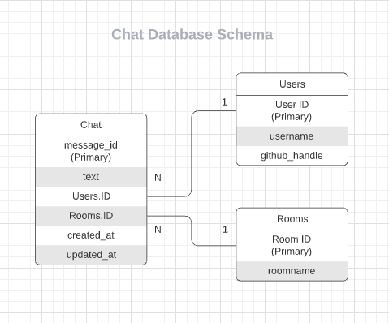
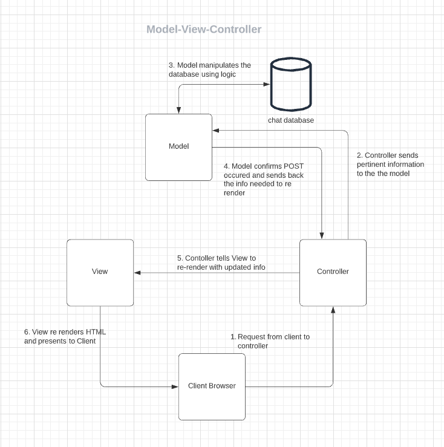
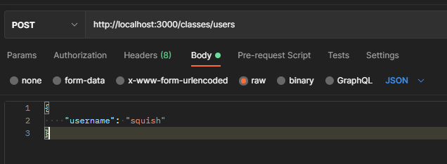

# Databases

## Schema



### Designing Schema

Schema, the organization of fields and records, is one of the first considerations to make when creating or interacting with an existing database.

## Model-View-Controller Pattern



[Lucid Chart](https://lucid.app/lucidchart/bebdc3b7-30f6-41d8-8a98-6c9b00a103d0/edit?shared=true&page=0_0#)

### Choose your own Pattern

The interactions between each piece of any application is decided by the developer.

## Starting the Database

```bash
$ sudo service mysql start
$ sudo service mysql status
$ mysql -u root -p

mysql>
```

This code will start up your database which is required in order to start the server in the next step.

## Building the Database

In this sprint we define a `schema.sql` file that can be executed as a script and passed into mysql in a bash terminal to create our database and tables. If the database we are trying to create already exists, we'll have to drop it from mysql first.

```sql
mysql> drop database chat;
```

Then we are ready to rebuild the database.

```bash
$ mysql -u root < server/schema.sql
```

Back in mysql we can confirm this worked.

```sql
mysql> show databases;
+--------------------+
| Database           |
+--------------------+
| chat               |
| information_schema |
| mysql              |
| performance_schema |
| sys                |
+--------------------+

mysql> use chat
mysql> show tables;
+----------------+
| Tables_in_chat |
+----------------+
| messages       |
| users          |
+----------------+

mysql> describe users;
+----------+-------------+------+-----+---------+----------------+
| Field    | Type        | Null | Key | Default | Extra          |
+----------+-------------+------+-----+---------+----------------+
| id       | int         | NO   | PRI | NULL    | auto_increment |
| username | varchar(40) | NO   |     | NULL    |                |
+----------+-------------+------+-----+---------+----------------+
```

## Starting the Server

It's always a good idea to inspect the `package.json` file to look for dependencies and scripts. In this case we see that we can start our server using the below script.

```json
  "scripts": {
    "start": "node ./server/app.js",
    /* ... */
  },
```

```bash
$ npm start
```

## Hitting Endpoints

Now that the server and database are fired up, you're ready to send HTTP requests! The simplest way to do this is via *postman*.



Look for messages in the server terminal, thanks to the *morgan* package that express uses in `app.js`. This is all assuming that the routes are configured correctly, requests have to be handled at their endpoints!

A couple great methods for responding to requests include

* `res.sendStatus(201);`
  * successfully created
* `res.json(data);`
  * respond with automatic headers

## Respond with Helpful Status Codes

Be more specific than the generic success/failure [status codes](https://developer.mozilla.org/en-US/docs/Web/HTTP/Status).

* `201` resource created
* `404` not found

## The right docs!

The libraries we are importing are managed by npm. Therefore the docs we should be ready are [npm docs](https://www.npmjs.com/package/mysql). MySQL is a database language that can be interacted with by virtually any programming language! We have to read about the implementation we're using!
